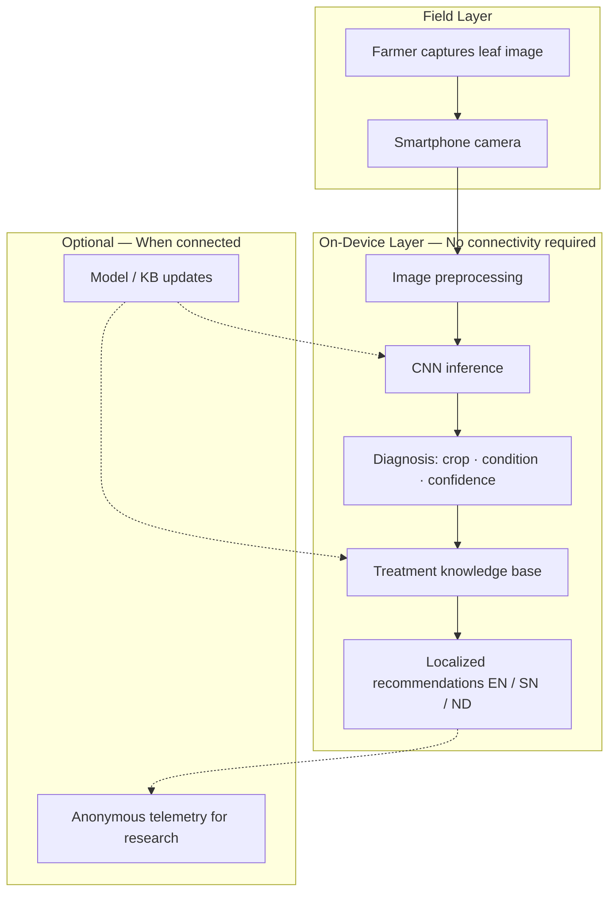

<div align="center">

**Research prototype** | **Area 8** — Empowering SMEs with 4IR and AI for Inclusive and Sustainable Growth  
**Category:** Prototype Demonstration

[](https://www.python.org/)
[](https://jupyter.org/)
[](LICENSE)
[]()

</div>

---

## Table of Contents

1. [Overview](#overview)
2. [Problem Statement](#problem-statement)
3. [Research Objectives](#research-objectives)
4. [System Concept](#system-concept)
5. [Policy and Development Alignment](#policy-and-development-alignment)
6. [Dataset](#dataset)
7. [Feasibility Analysis](#feasibility-analysis)
8. [Repository Structure](#repository-structure)
9. [Getting Started](#getting-started)
10. [Research Roadmap](#research-roadmap)
11. [Limitations and Ethical Considerations](#limitations-and-ethical-considerations)
12. [Citation](#citation)
13. [References](#references)

---

## Overview

**Kuravisor** is an offline artificial intelligence mobile application designed to democratize agricultural advisory services for rural Zimbabwean smallholder farmers. Farmers photograph affected crops using smartphones; a locally trained convolutional neural network (CNN) performs **on-device inference** to diagnose pests, diseases, and nutrient deficiencies **without internet connectivity**.

Based on the diagnosis, Kuravisor is intended to recommend:

- Appropriate agrochemical treatments  
- Natural treatment alternatives derived from locally available resources  
- Step-by-step application instructions  

The system will also support **predictive alerts** for potential future crop challenges based on observed plant and environmental patterns. To address language barriers, content is planned for **English**, **Shona**, and **Ndebele**, with presentation suited to varied literacy levels in rural communities.

This repository hosts the **research and engineering artefacts** for Kuravisor, beginning with an advanced exploratory data analysis (EDA) that establishes the feasibility of training an offline CNN on the project dataset.

---

## Problem Statement

| Challenge | Impact on smallholder farmers |
|-----------|------------------------------|
| Crop losses from pests and disease | Reduced yields and household food security |
| Internet-dependent digital tools | Exclusion of rural areas with unreliable connectivity |
| Commercially oriented platforms | Mismatch with small-scale, diverse cropping systems |
| Overburdened extension services | Delayed or unavailable real-time advisory support |
| Informal information networks | Unverified and potentially harmful treatment advice |

Zimbabwe's agricultural sector supports a large share of the population, yet rural smallholders remain disproportionately affected by these constraints. Kuravisor addresses the gap through an **offline-first**, **inclusive**, and **AI-enabled** precision agriculture prototype.

---

## Research Objectives

The study evaluates whether Kuravisor can be implemented as a credible prototype demonstration across technical, social, and policy dimensions.

| ID | Objective |
|----|-----------|
| O1 | Demonstrate feasibility of on-device CNN disease classification using available leaf-image data |
| O2 | Map dataset coverage to crops relevant to Zimbabwean smallholder production |
| O3 | Quantify class balance, image quality, and stratified splitting suitability for model training |
| O4 | Establish baseline metrics and artefacts for the prototype demonstration paper |
| O5 | Identify gaps requiring field data collection, localization, and extension-worker validation |

---

## System Concept

Kuravisor follows an **offline-first** architecture: inference and core advisory logic run on the farmer's device after models and knowledge bases are synchronized (e.g., during occasional connectivity or via sideloading).



### Planned capability matrix

| Capability | Description | Dependency |
|------------|-------------|------------|
| Visual diagnosis | Multi-class leaf disease / pest / deficiency classification | CNN + labeled training data |
| Treatment advisory | Agrochemical and natural remedy recommendations | Curated, trilingual knowledge base |
| Application guidance | Step-by-step instructions | Knowledge base + UI design |
| Predictive alerts | Early warning from plant and environmental patterns | Time-series / weather data (future work) |
| Multilingual delivery | English, Shona, Ndebele | Localization pipeline |

---

## Policy and Development Alignment

Kuravisor is positioned within national and international development frameworks relevant to Zimbabwe and inclusive 4IR adoption.

| Framework | Relevance |
|-----------|-----------|
| **Zimbabwe National Artificial Intelligence Strategy (2026–2030)** | Responsible, inclusive deployment of AI in priority sectors including agriculture |
| **Agriculture, Food Systems and Rural Transformation Strategy** | Strengthening smallholder productivity and resilient food systems |
| **SDG 2 — Zero Hunger** | Reducing crop losses and improving farmer decision-making for food security |
| **SDG 9 — Industry, Innovation and Infrastructure** | Building local innovation capacity and accessible digital infrastructure |
| **Theme: Area 8** | Empowering SMEs with 4IR and AI for inclusive and sustainable growth |

---

## Dataset

Training and feasibility analysis use the **Plant Leaf Diseases Dataset (with augmentation)**, organized in PlantVillage-style class folders:

```
dataset/
└── Plant_leave_diseases_dataset_with_augmentation/
    ├── Apple___Apple_scab/
    ├── Corn___Common_rust/
    ├── Tomato___Late_blight/
    └── ... (39 class folders)
```

Naming convention: `{Crop}___{Condition}` (e.g., `Corn___Northern_Leaf_Blight`).

> **Note:** The `dataset/` directory is excluded from version control due to size. Clone or download the dataset locally into the path above before running notebooks.

### Zimbabwe relevance tiers

Crops are mapped to priority tiers for smallholder relevance in Zimbabwe (maize appears as **Corn** in the source nomenclature).

| Tier | Crops in dataset | Rationale |
|------|------------------|-----------|
| **Tier 1 — High** | Corn (maize), Tomato, Potato, Pepper (bell), Squash | Staple and high-demand horticulture |
| **Tier 2 — Medium** | Soybean, Grape, Peach, Strawberry | Legumes and supplementary horticulture |
| **Tier 3 — Contextual** | Apple, Cherry, Orange, Blueberry, Raspberry | Lower prevalence; useful for transfer learning |
| **Non-target** | Background without leaves | Filter at capture / UX level |

---

## Feasibility Analysis

An advanced EDA notebook (`notebooks/kuravisor_feasibility_eda.ipynb`) assesses whether the dataset supports Kuravisor's offline CNN prototype. Summary metrics from the latest analysis run:

| Metric | Value |
|--------|------:|
| Total images | 61,486 |
| Classes | 39 |
| Crop species | 15 |
| Tier 1 (Zimbabwe priority) images | 30,502 (49.6% of dataset) |
| Tier 1 classes | 20 |
| Diseased / symptomatic class images | 41,875 |
| Gini coefficient (class inequality) | 0.281 |
| Max / min class size ratio | 5.51 |
| Stratified train split size | 43,040 |
| Minimum training samples per class | 700 |
| Median image resolution | 256 × 256 px |
| Images ≥ 224 px (both dimensions, sample) | 85.8% |

### Interpretation

| Finding | Implication |
|---------|-------------|
| Substantial Tier 1 volume | Strong foundation for Zimbabwe-relevant model classes |
| Moderate class imbalance | Address via class weighting, focal loss, or resampling; report macro-F1 |
| Resolution suitable for mobile CNNs | Compatible with MobileNet / EfficientNet-Lite at 224×224 input |
| Adequate per-class train counts | Stratified 70/15/15 split viable for prototype evaluation |
| Domain shift remains | Field validation on local varieties and growing conditions is mandatory |

Exported artefacts (after running the notebook):

| Output | Location |
|--------|----------|
| Feasibility summary | `notebooks/outputs/kuravisor_feasibility_summary.csv` |
| Class catalog | `notebooks/outputs/class_catalog.csv` |
| Imbalance metrics | `notebooks/outputs/imbalance_metrics.csv` |
| Intra-class diversity | `notebooks/outputs/intra_class_diversity.csv` |
| Figures (distribution, tiers, quality, taxonomy) | `notebooks/outputs/*.png` |

---

## Repository Structure

```
plant-disease-detection-system/
│
├── dataset/                          # Local only (gitignored)
│   └── Plant_leave_diseases_dataset_with_augmentation/
│
├── notebooks/
│   ├── kuravisor_feasibility_eda.ipynb # Advanced EDA for research paper
│   └── outputs/                      # Generated metrics and figures (gitignored)
│
├── requirements.txt                  # Python dependencies
├── .gitignore
└── README.md
```

---

## Getting Started

### Prerequisites

- Python 3.11 or later  
- Jupyter Notebook or JupyterLab  
- Dataset placed at `dataset/Plant_leave_diseases_dataset_with_augmentation/`

### Installation

```bash
git clone https://github.com/<your-org>/plant-disease-detection-system.git
cd plant-disease-detection-system

python -m venv .venv

# Windows
.venv\Scripts\activate

# macOS / Linux
source .venv/bin/activate

pip install -r requirements.txt
```

### Run the feasibility EDA

Execute from the **repository root**:

```bash
jupyter notebook notebooks/kuravisor_feasibility_eda.ipynb
```

Configuration highlights inside the notebook:

| Parameter | Default | Description |
|-----------|---------|-------------|
| `SAMPLE_PER_CLASS` | `80` | Images per class for quality EDA; set `None` for full pass |
| `TARGET_INPUT_SIZE` | `(224, 224)` | Mobile CNN input dimensions |
| `RANDOM_SEED` | `42` | Reproducible sampling and splits |

---

## Research Roadmap

```
  Phase 1 ─────────► Phase 2 ─────────► Phase 3 ─────────► Phase 4
  Feasibility         Model               Knowledge           Field
  & EDA               development         base & UI           pilot

  [CURRENT]           CNN training        EN / SN / ND        Extension
  Dataset audit       TFLite export       Treatment DB        worker co-design
  Tier mapping        Offline inference   Capture UX          Impact evaluation
```

| Phase | Deliverables | Status |
|-------|--------------|--------|
| **1 — Feasibility** | EDA notebook, summary metrics, class–crop mapping | In progress |
| **2 — Model** | Baseline CNN, fine-tune on Tier 1, TFLite conversion, on-device latency benchmarks | Planned |
| **3 — Advisory layer** | Trilingual treatment knowledge base, recommendation logic, capture guidelines | Planned |
| **4 — Validation** | Zimbabwe field images, extension-worker review, farmer usability study | Planned |

---

## Limitations and Ethical Considerations

- **Domain shift:** PlantVillage-style imagery may not fully represent local field conditions, lighting, or maize varieties grown in Zimbabwe.  
- **Advisory risk:** Automated treatment recommendations must be validated by qualified agronomists and extension services before deployment.  
- **Language and literacy:** Translations and UI design require community review; technical accuracy must not be sacrificed for brevity.  
- **Connectivity assumptions:** Model updates and knowledge-base revisions need a defined offline update path.  
- **Data governance:** Farmer-submitted images in future pilots require consent, storage policy, and privacy safeguards.  
- **Predictive alerts:** Environmental and seasonal models require data not present in the current static image dataset.

---

## Citation

If you use this repository in academic work, please cite the Kuravisor study (update when published):

```bibtex
@inproceedings{kuravisor2026,
  title     = {Kuravisor: An Offline {AI}-Powered Crop Disease Detection and Treatment Recommendation System for Smallholder Farmers in Zimbabwe},
  author    = {[Author Names]},
  booktitle = {[Venue — Prototype Demonstration, Area 8]},
  year      = {2026},
  note      = {Theme: Empowering SMEs with 4IR and AI for Inclusive and Sustainable Growth}
}
```

---

## References

1. Government of Zimbabwe. *National Artificial Intelligence Strategy* (2026–2030).  
2. Government of Zimbabwe. *Agriculture, Food Systems and Rural Transformation Strategy*.  
3. United Nations. *Sustainable Development Goals 2 and 9*. https://sdgs.un.org/  
4. PlantVillage / plant leaf disease datasets — basis for class nomenclature and folder structure.  
5. Frontiers in Sustainable Food Systems — smallholder maize systems and farmer typologies in Zimbabwe (e.g., Murehwa district studies).  
6. FAO / national horticulture reports — tomato, potato, and vegetable production statistics for Zimbabwe.

---

<div align="center">

**Kuravisor** — Precision agriculture for farmers who cannot wait for connectivity.

| Research | Contact | License |
|----------|---------|---------|
| Prototype demonstration · Area 8 | *[Add institutional contact]* | *[Add license]* |

</div>
